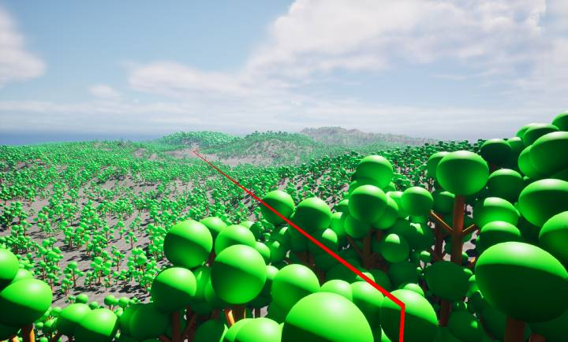
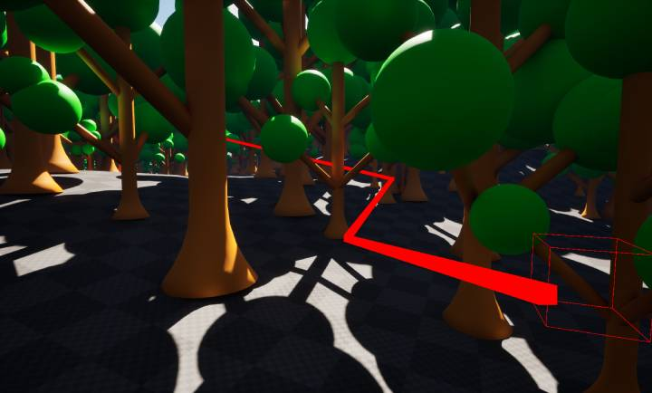

# GreedyNav Plugin

> 🔬 **Research & Performance Showcase:** This project was developed as a research endeavor to explore the theoretical boundaries of 3D volumetric navigation. The primary goal was to test how far spatial sparse representations and A* search heuristics can be pushed to maximize performance and minimize memory footprints in large-scale game environments.
>
> It serves as a volumetric, 3-D SDF navigation plugin for Unreal Engine 5, replacing the built-in 2-D NavMesh with a sparse Signed Distance Field for full 6-DOF pathfinding — designed for flying, swimming, or zero-gravity AI agents.

---

## Table of Contents

- [What Is GreedyNav?](#what-is-greedynav)
- [Quick Start](#quick-start)
- [System Architecture](#system-architecture)
- [Documentation](#documentation)
- [Console Command Reference](#console-command-reference)
- [Performance & Memory At a Glance](#performance--memory-at-a-glance)
- [Real-World Benchmarks](#real-world-benchmarks)
- [Roadmap](#roadmap)
- [Future Improvements](#future-improvements)
- [Build Configuration](#build-configuration)

---

## What Is GreedyNav?

GreedyNav bakes a **Signed Distance Field (SDF)** from static world geometry into a memory-
efficient sparse brick structure. Pathfinding then runs weighted A\* directly over this SDF,
using the distance values as a **safety cost** that steers agents away from walls.

| Feature | Details |
|---|---|
| Navigation space | Full 3-D (6 DOF) |
| Data structure | Sparse brick map (`FSDFBrick` — 4 KB per 16³ voxel chunk) |
| Bake strategy | Parallel wavefront BFS (shell-only, 250 cm radius) |
| Pathfinder | Weighted A\* (inadmissible, weight = 3.0) |
| Path post-processing | Greedy line-of-sight string-pull (Theta\*-style) |
| Integration | `UWorldSubsystem` — zero actor setup required |


<div align="center">



*GreedyNav smoothed path navigating 700 m across a large forest level — only 7 waypoints after string-pull post-processing.*

</div>

---

## Quick Start

### 1. Enable the Plugin
The plugin is located at `Plugins/GreedyNav/`. Ensure it is enabled in your `.uproject`:

```json
{
    "Name": "GreedyNav",
    "Enabled": true
}
```

### 2. Set the Bake Volume

Open the console (`~`) and configure the bake extents (half-extents in cm) and resolution:

```
Nav.BakeSettings 5000 5000 2000 50
```

The bake volume is always centred at world origin `(0, 0, 0)`.

### 3. Bake

```
Nav.Bake
```

Monitor the Output Log for timing and memory statistics.

### 4. Test Pathfinding

```
Nav.Test path -1000 0 200 1000 0 200
```

A green line will be drawn if a path is found.

### 5. Query the SDF in C++

```cpp
// Get the subsystem
UVolumetricSubsystem* Nav = GetWorld()->GetSubsystem<UVolumetricSubsystem>();
if (!Nav) return;

// Query point
TArray<FVector> Path;
bool bFound = FVolumetricPathfinder::FindPath(
    StartLocation, EndLocation,
    Nav->RawSparseGrid, Path);

// Use Path[0..N-1] as waypoints
```

---

## System Architecture

```
 World Geometry (Static Meshes)
          │
          ▼
 ┌──────────────────────┐
 │   Voxelizer Layer    │   Two strategies (only FFastCpuVoxelizer active)
 │  FFastCpuVoxelizer ✅│ ← Default: triangle + primitive rasterisation
 │  FSparseCollision ⚠️ │ ← Alternate: primitive-first, incomplete (dead stubs removed)
 └──────────┬───────────┘
            │  TArray<int64>  (blocked voxel indices)
            ▼
 ┌──────────────────────┐
 │  FVolumetricBaker    │   Parallel wavefront BFS → SDF propagation
 │  BakeSVO()           │   Shell culling + brick compression
 └──────────┬───────────┘
            │  FSparseVolumetricGrid  (in-memory page table)
            ▼
 ┌──────────────────────┐
 │ FVolumetricPathfinder│   Weighted A* + SDF safety cost
 │  FindPath()          │   → SmoothPath() (line-of-sight shortcut)
 └──────────┬───────────┘
            │  TArray<FVector>  (world-space waypoints)
            ▼
        AI / Caller
```

The `UVolumetricSubsystem` owns the live grid and wires everything together via console
commands. See [Architecture Overview →](./Plugins/GreedyNav/docs/01_architecture_overview.md).

---

## Documentation

| Doc | Description |
|-----|-------------|
| [01 — Architecture Overview](./Plugins/GreedyNav/docs/01_architecture_overview.md) | Pipeline diagram, module layout, subsystem lifetime, threading model, coordinate system |
| [02 — Voxelizers](./Plugins/GreedyNav/docs/02_voxelizers.md) | `FFastCpuVoxelizer` and `FSparseCollisionVoxelizer` — algorithms, limitations, selection (dead stubs removed) |
| [03 — SDF Baker](./Plugins/GreedyNav/docs/03_sdf_baker.md) | Parallel wavefront BFS, `FMassiveBitArray`, `FFrontierShard`, shell propagation, brick compression |
| [04 — Pathfinder](./Plugins/GreedyNav/docs/04_pathfinder.md) | Weighted A\*, cost function, path smoothing, `FindNearestSafeVoxel`, `GetGradient` stub |
| [06 — Performance & Memory](./Plugins/GreedyNav/docs/06_performance_and_memory.md) | Memory model, bake time estimator, bottleneck analysis, optimisation priority list |
| [07 — Data Structures](./Plugins/GreedyNav/docs/07_data_structures.md) | `FSDFBrick`, `FSparseVolumetricGrid`, tagged pointer semantics, index arithmetic |
| [08 — Console Commands](./Plugins/GreedyNav/docs/08_console_commands.md) | Full reference for all `Nav.*` and `Greedy.*` commands |

---

## Console Command Reference

| Command | Description |
|---|---|
| `Nav.BakeSettings X Y Z Res` | Set bake extents (cm half-extent) and resolution |
| `Nav.Bake` | Run full voxelise + bake pipeline |
| `Nav.Debug` | Visualise SDF voxels within 50 m of player |
| `Nav.Slice Z` | Draw blocked voxels at world Z (raw voxeliser data) |
| `Nav.Probe X Y Z` | Query SDF distance at world point |
| `Nav.Test path Sx Sy Sz Ex Ey Ez` | Run and visualise a test path |
| `Greedy.Bake` | Run full voxelise + bake pipeline (module console command version) |

Full details: [Console Commands →](./Plugins/GreedyNav/docs/08_console_commands.md)


## Performance & Memory At a Glance

| Config / Extents (cm) | Resolution (cm) | Logical Voxels | Blocked Voxels | Measured Bake Time | RAM Footprint | Notes |
|---|---|---|---|---|---|---|
| 50000 × 50000 × 10000 | 50 | 1.6 B | 60,199,796 | **10.41 s** (Total) | **422.32 MB** | **Measured (Workstation)** |

> Bake times are **editor-time** operations. The compiled SDF grid is designed to be loaded at runtime with no re-bake cost.

Full analysis: [Performance & Memory →](./Plugins/GreedyNav/docs/06_performance_and_memory.md)

---

## Real-World Benchmarks

The following results were captured on a 6-core workstation using a real game level with **43 static mesh components**.

### Bake — 1 km × 1 km × 200 m @ 50 cm resolution

```
Nav.BakeSettings 50000 50000 10000 50
Nav.Bake
```

| Metric | Value |
|---|---|
| Logical voxel volume | 2,000 × 2,000 × 400 = **1.6 Billion** voxels |
| Blocked voxels (geometry) | 60,199,796 (~3.8% of volume) |
| Active SDF bricks | 107,351 |
| Solid-tagged bricks | 1,250 |
| **Grid RAM footprint** | **422.32 MB** |
| Dense-grid equivalent | ~6.4 GB (float) — **93% compression vs naïve grid** |
| Voxelizer time | 4,326 ms |
| Baker / SDF propagation time | 6,048 ms |
| **Total editor bake time** | **~10.4 s** |

### Pathfinding — 700 m query across the baked volume

```
Nav.Test path 3720 41340 3630 27560 -30780 370
```

| Metric | Value |
|---|---|
| Query distance | ~700 m (line of sight) |
| A\* raw nodes expanded | 2,021 |
| Smoothed waypoints | **7** |
| **Query time** | **16.62 ms** |

<div align="center">



*Close-up view: A\* path (red line) weaving through dense static-mesh geometry, with SDF safety cost keeping the agent clear of trunks.*

</div>

> A 700 m 3D volumetric path with safety-aware cost in under 17 ms — well within a single 60 FPS frame budget.

### Key Takeaways

- **Sparse compression is the system's core strength:** only ~8.5% of logical brick slots contain real SDF data on a dense urban/terrain level. Open spaces (sky, large halls) are free.
- **Pathfinding scales well with the planned chunking system:** since agents will only query a local spatial chunk, the number of expanded nodes will drop significantly below the 2,021 measured here, pushing query times comfortably under 5 ms.
- **A* heuristic weight of 3.0 is well-tuned** for open aerial navigation — the solver barely scratches the grid surface before converging, which is the ideal regime for a flying AI.

---

## Roadmap

### Must-Fix (Pre-Ship) [DONE]

- [x] Add `FSparseVolumetricGrid` destructor to prevent brick memory leaks
- [x] Unregister all console commands in `Deinitialize()`
- [x] Fix or remove `GetGradient()` declaration (fully implemented)
- [x] Fix `Greedy.Bake` to actually call `ExecuteBakeMesh`

### Should-Fix (Quality)

- [ ] **Spatial chunking system** — partition the grid into spatial chunks so pathfinding agents only query a local sub-volume; this directly caps maximum node expansion count and per-query RAM regardless of total map size
- [ ] Binary serialization for persistent bakes — bake once in editor, load compiled grid at runtime in <100 ms
- [ ] Implement `FPhysicsVoxelizer` for runtime/dynamic geometry
- [ ] Expose `MaxShellDist` as a configurable property
- [ ] Move bake pipeline to an async background task (for optional runtime rebakes)
- [ ] Replace `TMap` in pathfinder with a cache-friendly open-addressing structure

### Nice-to-Have

- [ ] Runtime voxelizer strategy selection (console variable or UPROPERTY)
- [ ] Define `DECLARE_LOG_CATEGORY(LogGreedyNav)` — stop polluting `LogTemp`
- [ ] Move `.cpp` files from `Public/` to `Private/`
- [ ] Implement gradient-descent navigation mode using `GetGradient()`
- [ ] Integrate `DECLARE_MEMORY_STAT` group for live brick RAM tracking in Unreal Insights

---

## Future Improvements

The following architectural and performance enhancements are planned to further optimize the system:

### 1. Entire Bake Pipeline Asynchronous Refactoring
* **Current:** `ExecuteBakeMesh()` runs synchronously. For large volumes (e.g., 50k × 50k × 10k cm @ 50 cm resolution), this can block the calling thread during execution.
* **Plan:** Dispatch the bake via `AsyncTask(ENamedThreads::AnyBackgroundThreadNormalTask, ...)`, notify the Subsystem on completion, and lock reads during the rebake to keep the engine completely hitch-free.

### 2. SparseCollisionVoxelizer — Thread-Local Buffers
* **Current:** Uses a single global `FCriticalSection` mutex inside `ParallelFor`. Every parallel worker task locks the mutex before appending to `OutBlockedIndices`, bottlenecking parallel execution.
* **Plan:** Refactor the worker task to write to per-task local buffers (matching the design of `FastCpuVoxelizer`), then append the results sequentially, restoring fully scalable parallel speedups.

### 3. FindNearestSafeVoxel — Proper Queue BFS
* **Current:** Performs a triple-nested loop O(R³) shell search. At step 10, this can query up to 9,261 voxels, doing redundant distance lookups.
* **Plan:** Implement a standard queue-based Breadth-First Search (BFS) to efficiently discover the nearest safe voxel without redundant calculations.

### 4. Ray-Casting Step Limit Tuning for IsLineSafe
* **Current:** Truncates ray-casts to a hard cap of 1,000 steps (equivalent to 250 m at 50 cm resolution), meaning long path smoothing shortcuts could theoretically miss obstacles beyond 250 m.
* **Plan:** Make the step limit dynamic based on query distance or expose it as a tunable parameter so high-scale environments are checked completely.

### 5. Persistent Bake Serialization
* **Current:** Compiled Signed Distance Field (SDF) grid is stored purely in memory and must be rebaked each session in the editor.
* **Plan:** Serialize `FSparseVolumetricGrid` directly to disk as a binary blob, enabling runtime loading of pre-compiled grids in < 100 ms without rebake overhead.

### 6. Pathfinder Open-Set Optimization (TMap Replacement)
* **Current:** Weighted A* pathfinding uses an unbounded `TMap<int64, FNodeContext>` open-set, which is cache-hostile and incurs heap allocations.
* **Plan:** Replace `TMap` with a slab-allocated, cache-friendly open-addressing map to minimize cache misses and eliminate allocation overhead during tight search loops.

### 7. Configurable Shell Distance
* **Current:** Voxel wavefront BFS propagates to a hardcoded shell distance of 250 cm.
* **Plan:** Drive the shell distance dynamically from the navigating agent's capsule radius, or expose it as a tunable property.

### 8. Dynamic Geometry Voxelization (`FPhysicsVoxelizer`)
* **Current:** Voxelization only supports static static-mesh components gathered during editor-time or initial load.
* **Plan:** Implement `FPhysicsVoxelizer` using runtime physics-collision sweep/overlap queries to allow real-time voxelization of dynamic obstacles.

### 9. Extensible Voxelizer Strategy Selection
* **Current:** Voxelization strategy selection is hardcoded to `FastCpuVoxelizer`.
* **Plan:** Expose voxelizer strategy selection as a configurable enum per-subsystem or per-pathfinding-query.

---

## Build Configuration

**Module:** `GreedyNav` — Runtime, Default loading phase.

**Dependencies:**

| Module | Visibility | Note |
|---|---|---|
| `Core` | Public | UE core types |
| `CoreUObject` | Private | `UObject` / `UWorldSubsystem` |
| `Engine` | Private | `UStaticMeshComponent`, `UWorld` |
| `Slate` / `SlateCore` | Private | Registered but unused in current code |
| `Landscape` | Private | Registered but unused — leftover |
| `UnrealEd` | Private (editor-only) | `GEditor` access in `GreedyNav.cpp` |

> `Slate` and `Landscape` dependencies are declared but **not used** by any current code.
> They can be safely removed to reduce compile time.

**PCH Mode:** `UseExplicitOrSharedPCHs` — correct for a plugin.

**CPU Access requirement:** Complex-mesh voxelisation in `FFastCpuVoxelizer` requires
`bAllowCPUAccess = true` on `UStaticMesh` assets, or must be run in the Editor. Shipping
builds without this will fall back to bounding-box approximation silently.

---

> 🛠️ **Developer Note:** This research project and codebase were developed with assistance from **Antigravity**, an AI coding assistant designed by the Google DeepMind team.

